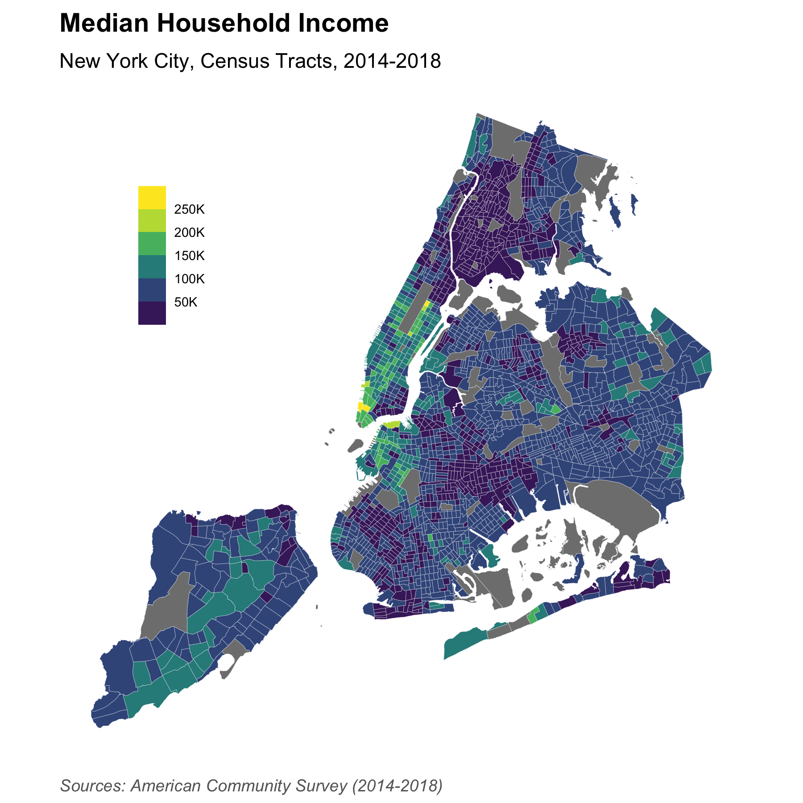

```{r setup, include=FALSE}
knitr::opts_chunk$set(echo = TRUE)

library(tidyverse)
library(sf)
library(here)

# Load some custom utility functions (ggplot themes)
source(here("code", "utils.R"))
```

```{r}
nyc_tracts_acs_sf <- read_rds(here("data", "clean", "nyc_tracts_acs_sf.rds"))
```

```{r}
nyc_renter_pct_map <- ggplot(nyc_tracts_acs_sf) +
  aes(fill = renter_pctE) +
  geom_sf(color = "white", size = 0.05) +
  scale_fill_viridis_b(labels = scales::percent) +
  theme_void() +
  theme(legend.position = c(0.1, .75)) +
  labs(
    title = "Renter Share of Units",
    subtitle = "New York City, Census Tracts, 2014-2018",
    fill = NULL,
    caption = "Sources: American Community Survey (2014-2018)"
  )

ggsave(here("img", "nyc_renter_pct_map.png"), nyc_renter_pct_map, width = 6, height = 6)
```


```{r}
nyc_hh_inc_map <- ggplot(nyc_tracts_acs_sf) +
  aes(fill = hh_inc_medE) +
  geom_sf(color = "white", size = 0.05) +
  scale_fill_viridis_b(labels = scales::label_number_si()) +
  theme_mspp_map() +
  theme(legend.position = c(0.1, .75)) +
  labs(
    title = "Median Household Income",
    subtitle = "New York City, Census Tracts, 2014-2018",
    fill = NULL,
    caption = "Sources: American Community Survey (2014-2018)"
  )

ggsave(here("img", "nyc_hh_inc_map.png"), nyc_hh_inc_map, width = 6, height = 6)
```


