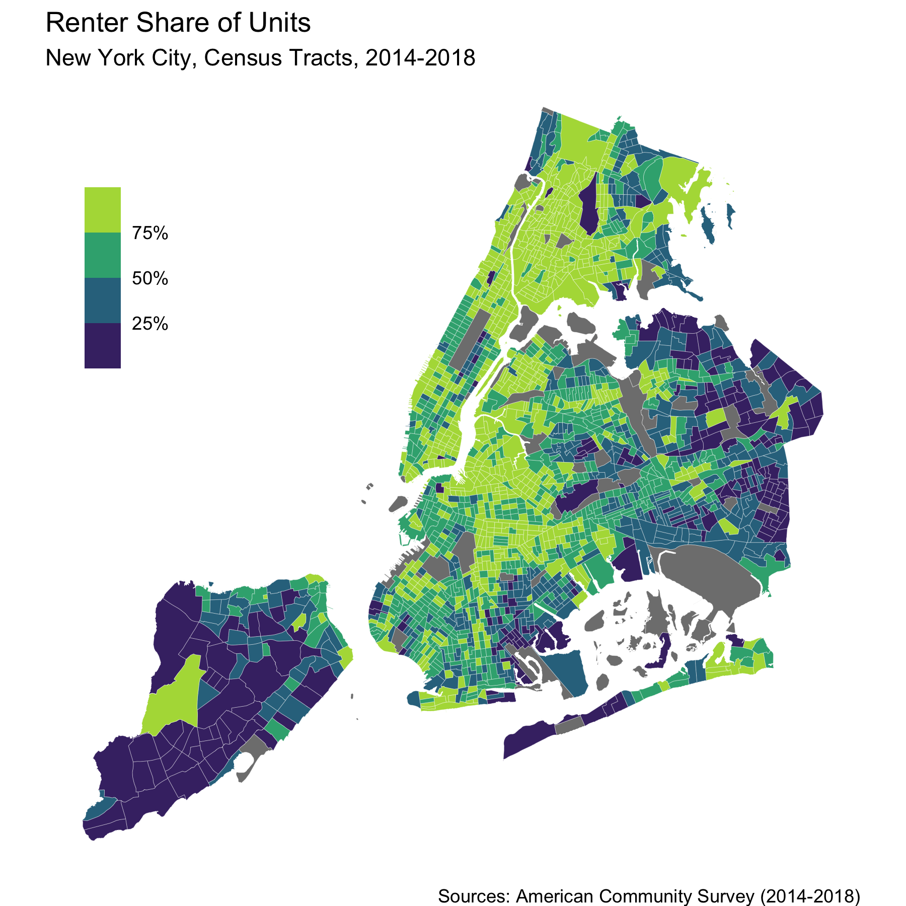

```{r setup, include=FALSE}
knitr::opts_chunk$set(echo = TRUE)

library(tidyverse)
library(sf)
library(here)

# Load some custom utility functions (ggplot themes)
source(here("code", "utils.R"))
```

```{r}
nyc_tracts_acs_sf <- read_rds(here("data", "clean", "nyc_tracts_acs_sf.rds"))
```

```{r}
nyc_renter_pct_map <- ggplot(nyc_tracts_acs_sf) +
  aes(fill = renter_pctE) +
  geom_sf(color = "white", size = 0.05) +
  scale_fill_viridis_b(labels = scales::percent) +
  theme_void() +
  theme(legend.position = c(0.1, .75)) +
  labs(
    title = "Renter Share of Units",
    subtitle = "New York City, Census Tracts, 2014-2018",
    fill = NULL,
    caption = "Sources: American Community Survey (2014-2018)"
  )

ggsave(here("img", "nyc_renter_pct_map.png"), nyc_renter_pct_map, width = 6, height = 6)
```



```{r}
nyc_hh_inc_map <- ggplot(nyc_tracts_acs_sf) +
  aes(fill = hh_inc_medE) +
  geom_sf(color = "white", size = 0.05) +
  scale_fill_viridis_b(labels = scales::label_number_si()) +
  theme_mspp_map() +
  theme(legend.position = c(0.1, .75)) +
  labs(
    title = "Median Household Income",
    subtitle = "New York City, Census Tracts, 2014-2018",
    fill = NULL,
    caption = "Sources: American Community Survey (2014-2018)"
  )

ggsave(here("img", "nyc_hh_inc_map.png"), nyc_hh_inc_map, width = 6, height = 6)
```


## Interactive  visualizations with Plotly

Plotly is a popular javascript framework for interactive data visualization, and they have a [Python](https://plotly.com/python/) and [R](https://plotly.com/r/) library that makes it easy to take advantage of all the great interactive features without haveing to learn javascript.

For examples in Python see the repo [`python-project`](https://github.com/wagner-mspp-2020/python-project).

In R the easiest way to start using plotly is to take advantage of the amazing `ggplotly()` function, which takes a regular static ggplot object and automatically converts it to an interactive version. Since you already are familiar with ggplot from all the previous examples, this is usually much easier than learning a whole new set of plotly-specific functions. 

```{r message=FALSE, warning=FALSE}
library(plotly)
```

```[r]

p <- ggplot(nyc_tracts_acs_sf) +
  aes(x = rent_burden_medE, y = hh_inc_medE, color = boroname) +
  geom_point()

ggplotly(p)
```

```{r}
p <- ggplot(nyc_tracts_acs_sf) +
  aes(x = rent_burden_medE, y = hh_inc_medE) +
  geom_point() +
  facet_wrap(~boroname)

ggplotly(p)
```

The easiest way to custom the hover-over tooltip text is by creating a new column in your dataset first, and then map that column to the "text" aesthetic in ggplot, then when using `ggplotly()` set the tooltip to `"text"`. When constructing the text column the function `str_glue()` can be very helpful. Within the text in `str_glue` anything inside curly-braces `{}` gets evaluated first as R code, and this is done for all rows, so you can refer to multiple existing columns and create nicely formatted tooltip text. For example, here we make use of formatting functions from the `scales` package that take numeric data and return formatted text. 

```{r message=FALSE, warning=FALSE}
library(scales)
```

```{r}
p <- nyc_tracts_acs_sf %>% 
  mutate(
    hover_text = str_glue(
      "Median Rent Burden: {percent(rent_burden_medE/100, 1)} (±{percent(rent_burden_medM/100, 1)})
      Median Household Income: {dollar(hh_inc_medE)} (±{comma(hh_inc_medM, 1)})"
    )
  ) %>% 
  ggplot() +
  aes(x = rent_burden_medE, y = hh_inc_medE, color = boroname, text = hover_text) +
  geom_point()

ggplotly(p, tooltip = "text")
```


## Interactive Maps in R with Leaflet

Leaflet is a popular javascript web mapping framework, and there is a [leaflet R package](https://rstudio.github.io/leaflet/) that allows you to create interactive maps directly from sf dataframes that we have been using. The documentation website is very comprehensive, and there are many customization options. We'll just cover some of the essentials here. 

There are a couple options for adding basemaps - the easiest option is using `ddProviderTiles()` and using one of the available options - I prefer the more muted `providers$CartoDB.Positron` option. 

Recently they've add support for basemaps from MapboxGL. To get access to these you need to install the `leaflet.mapboxgl` package from GitHub using `remotes::install_github("rstudio/leaflet.mapboxgl")`. Then [sign up for a free Mapbox token](https://docs.mapbox.com/help/how-mapbox-works/access-tokens/#creating-and-managing-access-tokens). For this demo you can use mine, but then you need to get your own. Not only are these maps more clear, but you can also completely customize the basemap on the Mapbox Studio website and then use that custom basemap in your R leaflet map. 

```{r}
library(leaflet)
library(leaflet.mapboxgl) # remotes::install_github("rstudio/leaflet.mapboxgl")

# If you want to create custom basemaps and use those, you'll need a token, but
# we'll be using preexisting ones from mapbox so we can set this to NA

options(mapbox.accessToken = "pk.eyJ1IjoiYXVzdGVuc2VuIiwiYSI6ImNqa2lnOXJhYTAwOHgzcnM2bDk1b2wyMzQifQ.4TZ4jUC2_LDICORTKVR3yg")
```

For this example we'll be making a simple choropleth map with our census tract data. The first step is to set up the categories and color palette for our map. Leaflet has a somewhat odd approach to this. You need to create a function that knows how to categorizes values and match them to the appropriate colors and labels. You do this using the functions like `leaflet::colorBin` (use the auto-complete so see the various options), and provide a color palette, the column from your dataset that you will be mapping, and the number of categories. 

```{r}
# This creates a function that takes a column of values and categorizes them an
# matches it to a color in the way that leaflet requires
hh_inc_pal <- colorBin(viridisLite::viridis(5), nyc_tracts_acs_sf$hh_inc_medE, n=5)
```

Now we can start with the map! First you need to re-project your sf dataframe to use EPSG:4326 (lat/lon), wince that's what leflet requires. 

Then you can pass that sf dataframe into the `leaflet()` function to start your map. Simple to our dplyr analysis pipelines, leaflet makes use of the `%>%` (pipe) operator to pass the map through a series of leflet functions to continually build up the parts of the map. 

The first step is to add the basemap we want to use. You'll see the two options discussed above. 

Then add your data and geometries. We have census tract boundaries, so we'll be using `addPolygons` - if you have point data there are a few options, but `addCircleMarkers()` is the most flexible.

Within the `addPolygons` function we can use the `popup` argument to specify what text should be displayed in the on-click tooltip box for each polygon. Again, we'll use the `str_glue` function,  `scales` formatters, and some simple HTML to help use create a clear and informative tooltip.

```{r}
nyc_map_leaflet <- nyc_tracts_acs_sf %>% 
  # You should always re-project your data into lat/lon 4326 CRS
  st_transform(4326) %>% 
  leaflet() %>% 
  # This option doesn't require a token
  # addProviderTiles(providers$CartoDB.Positron) %>% 
  # This option requires a token - you can use mine to test it out today, but
  # then need to sig up for your own (free) token
  addMapboxGL(style = "mapbox://styles/mapbox/light-v9") %>%
  addPolygons(
    # In leaflet to refer to columns in your dataframe in arguments use the ~ at the beginning
    fillColor = ~hh_inc_pal(hh_inc_medE),
    fillOpacity = 0.7,
    color = "white",
    weight = 0.5,
    # You can use html to format this any way you want. Here we use str_glue()
    # to insert values from our columns and use R formatting funcitons.
    # Everything inside the {} gets evaluated as R code
    popup = ~str_glue("<strong>Median Household Income (2014-2018)</strong><br>
                      {dollar(hh_inc_medE)} (±{comma(hh_inc_medM, 1)})")
  ) %>% 
  addLegend(
    position = "topleft", 
    pal = hh_inc_pal, 
    values = ~hh_inc_medE, 
    labFormat = labelFormat(prefix = "$"),
    title = "Median Household Income<br>by Census Tract (2014-2018)"
  )

nyc_map_leaflet
```

If you print the result of the leaflet functions the interactive map can be included directly in the final Rmarkdown document, but this only wors with the `html_output` option. You can also use the `htmlwidgets` package to export our map to an HTML file. You can even then host this as mini website using GitHub (ask me for examples/help if you want to do this, it's not that hard).

```{r}
htmlwidgets::saveWidget(nyc_map_leaflet, here("docs", "nyc-map-leaflet.html"), selfcontained = TRUE)
```

